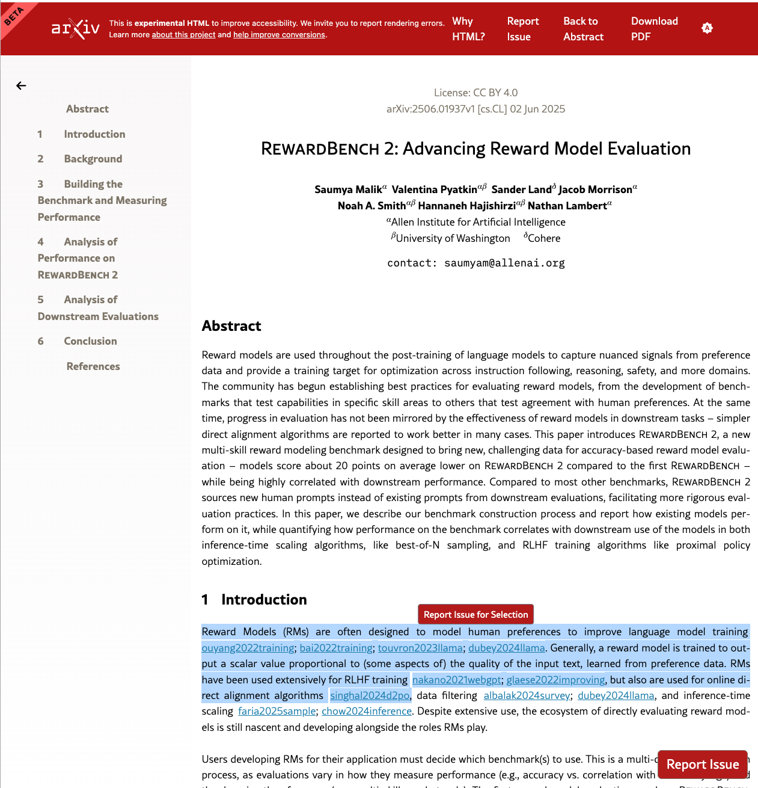
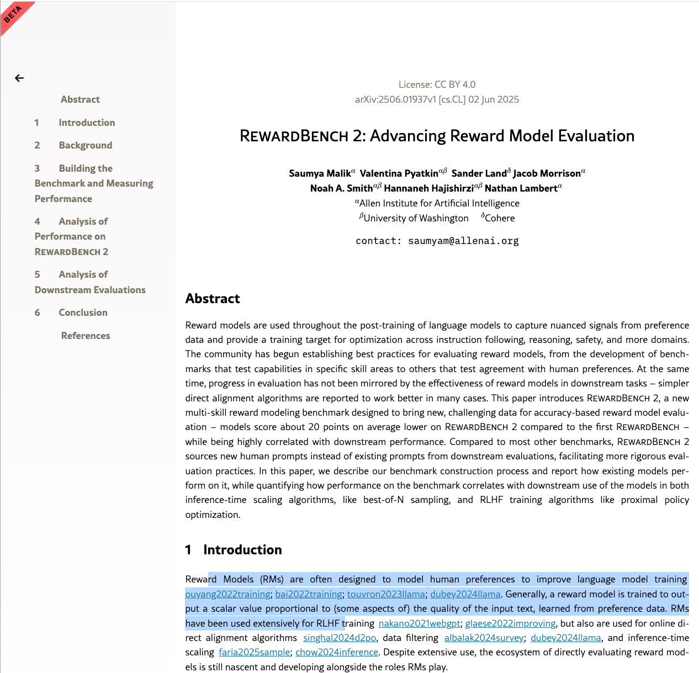

# arXiv HTML UI Toggle Chrome Extension

This Chrome extension hides UI elements on arXiv HTML pages and provides a toggle button to show/hide them.

## Features

- Hides header elements, "Report Issue" button, and "Why HTML?" button by default
- Shows a "UI ENABLED" toggle button when mouse is near bottom-right corner
- Toggle button changes color based on state (red=disabled, green=enabled)
- Works on `https://arxiv.org/html/*` pages

## Installation

1. Open Chrome and navigate to `chrome://extensions/`
2. Enable "Developer mode" in the top right
3. Click "Load unpacked" and select this folder
4. The extension will be installed and active

## Usage

1. Visit any arXiv HTML page (e.g., `https://arxiv.org/html/2506.01937v1`)
2. The header and buttons will be hidden by default
3. Move your mouse near the bottom-right corner to reveal the toggle button
4. Click the toggle button to show/hide the UI elements

## Screenshots

**Before (annoying UI elements, especially the "Report Issue" button above highlighted text):**

**After (UI elements hidden):**

## Files

- `manifest.json` - Extension configuration
- `content.js` - Content script that handles UI hiding and toggle functionality
- `README.md` - This documentation

## Hidden Elements

The extension hides these elements by default:
- Header with class `desktop_header`
- "Report Issue" buttons
- "Why HTML?" buttons
- Related footer elements